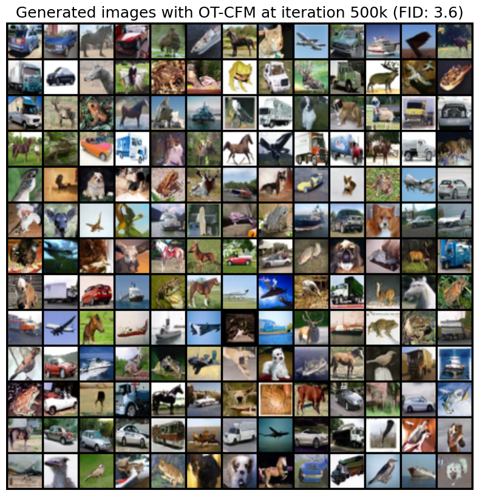

# CIFAR-10 experiments using TorchCFM

This repository is used to reproduce the CIFAR-10 experiments from [1](https://arxiv.org/abs/2302.00482). We have designed a novel experimental procedure that helps us to reach an __FID of 3.5__ on the Cifar10 dataset.

<p align="center">

</p>

To reproduce the experiments and save the weights, install the requirements from the main repository and then run (runs on a single RTX 2080 GPU):

- For the OT-Conditional Flow Matching method:

```bash
python3 train_cifar10.py --model "otcfm" --lr 2e-4 --ema_decay 0.9999 --batch_size 128 --total_steps 400001 --save_step 20000
```

- For the Independent Conditional Flow Matching (I-CFM) method:

```bash
python3 train_cifar10.py --model "icfm" --lr 2e-4 --ema_decay 0.9999 --batch_size 128 --total_steps 400001 --save_step 20000
```

- For the original Flow Matching method:

```bash
python3 train_cifar10.py --model "fm" --lr 2e-4 --ema_decay 0.9999 --batch_size 128 --total_steps 400001 --save_step 20000
```

To compute the FID from the OT-CFM model at end of training, run:

```bash
python3 compute_fid.py --model "otcfm" --step 400000 --integration_method dopri5
```

For the other models, change the "otcfm" argument by "icfm" or "fm". For easy reproducibility of our results, you can download the model weights at 400000 iterations here:

- [icfm weights](https://github.com/atong01/conditional-flow-matching/releases/download/1.0.4/cfm_cifar10_weights_step_400000.pt)

- [otcfm weights](https://github.com/atong01/conditional-flow-matching/releases/download/1.0.4/otcfm_cifar10_weights_step_400000.pt)

- [fm weights](https://github.com/atong01/conditional-flow-matching/releases/download/1.0.4/fm_cifar10_weights_step_400000.pt)

To recompute the FID, change the PATH variable with where you have saved the downloaded weights.

If you find this code useful in your research, please cite the following papers (expand for BibTeX):

<details>
<summary>
A. Tong, N. Malkin, G. Huguet, Y. Zhang, J. Rector-Brooks, K. Fatras, G. Wolf, Y. Bengio. Improving and Generalizing Flow-Based Generative Models with Minibatch Optimal Transport, 2023.
</summary>

```bibtex
@article{tong2023improving,
  title={Improving and Generalizing Flow-Based Generative Models with Minibatch Optimal Transport},
  author={Tong, Alexander and Malkin, Nikolay and Huguet, Guillaume and Zhang, Yanlei and {Rector-Brooks}, Jarrid and Fatras, Kilian and Wolf, Guy and Bengio, Yoshua},
  year={2023},
  journal={arXiv preprint 2302.00482}
}
```

</details>

<details>
<summary>
A. Tong, N. Malkin, K. Fatras, L. Atanackovic, Y. Zhang, G. Huguet, G. Wolf, Y. Bengio. Simulation-Free Schrödinger Bridges via Score and Flow Matching, 2023.
</summary>

```bibtex
@article{tong2023simulation,
   title={Simulation-Free Schr{\"o}dinger Bridges via Score and Flow Matching},
   author={Tong, Alexander and Malkin, Nikolay and Fatras, Kilian and Atanackovic, Lazar and Zhang, Yanlei and Huguet, Guillaume and Wolf, Guy and Bengio, Yoshua},
   year={2023},
   journal={arXiv preprint 2307.03672}
}
```
